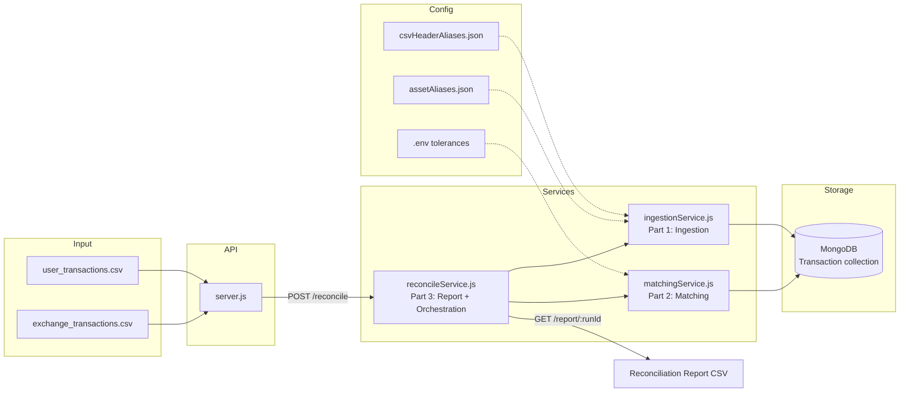

# KoinX — Transaction Reconciliation Engine

Backend service that ingests **user** and **exchange** transaction CSVs, matches rows across sources with configurable tolerances, and produces an **audit-friendly CSV report** suitable for Excel.

Built for the KoinX backend take-home assignment.

---

## Architecture



### Data flow (one reconciliation run)

1. **`POST /reconcile`** creates a `runId` (UUID) and ingests both CSVs.
2. **Ingestion** normalizes fields, flags invalid rows (never dropped), stores `rawRow` for audit.
3. **Matching** pairs user ↔ exchange using timestamp/quantity tolerances and type/asset rules.
4. **Report** reads MongoDB state and exports a structured CSV with categories + original rows.

---

## Project structure

| Path | Responsibility |
|------|----------------|
| `services/ingestionService.js` | **Part 1** — parse CSV, validate, persist |
| `services/matchingService.js` | **Part 2** — matching algorithm + status updates |
| `services/reconcileService.js` | **Part 3** — orchestration + CSV report + summary helpers |
| `server.js` | **Part 4** — REST API (thin layer) |
| `models/Transaction.js` | Mongoose schema |
| `config/assetAliases.json` | Asset synonym mapping (e.g. `BITCOIN` → `BTC`) |
| `config/csvHeaderAliases.json` | CSV header synonym mapping |
| `data/` | **Local input folder** (CSVs not committed — see below) |
| `logger.js` | Structured console logging |

---

## Prerequisites

- **Node.js** 18+ (tested on 22.x)
- **MongoDB** (Atlas or local)
- CSV files placed under `data/` (see [data/README.md](data/README.md))

---

## Setup

### 1. Install dependencies

```bash
npm install
```

### 2. Environment variables

Copy `.env.example` to `.env`:

```bash
cp .env.example .env
```

| Variable | Required | Default | Description |
|----------|----------|---------|-------------|
| `MONGO_URI` | Yes | — | MongoDB connection string |
| `PORT` | No | `3000` | HTTP port |
| `TIMESTAMP_TOLERANCE_SECONDS` | No | `300` | ± window for timestamp matching |
| `QUANTITY_TOLERANCE_PCT` | No | `0.01` | Quantity tolerance in **percent** (0.01 = 0.01%) |

### 3. Add input CSVs (important for reviewers)

**Sample CSVs from the assignment are not committed to this repo.**

Place your files here:

```
data/user_transactions.csv
data/exchange_transactions.csv
```

Or pass custom paths in `POST /reconcile` body (`userCsvPath`, `exchangeCsvPath`).

See [data/README.md](data/README.md) for expected columns.

### 4. Start the server

```bash
npm run start
```

Example log output:

```text
[2026-05-28T12:00:00.000Z] [INFO] Connected to MongoDB {"database":"test"}
[2026-05-28T12:00:00.100Z] [INFO] API listening {"url":"http://localhost:3000",...}
```

---

## API

### Health check

```bash
curl -s http://localhost:3000/health
```

### Run reconciliation (ingest + match)

```bash
curl -s -X POST http://localhost:3000/reconcile \
  -H "Content-Type: application/json" \
  -d '{}'
```

Optional body overrides:

```bash
curl -s -X POST http://localhost:3000/reconcile \
  -H "Content-Type: application/json" \
  -d '{
    "timestampToleranceSeconds": 300,
    "quantityTolerancePct": 0.01,
    "userCsvPath": "data/user_transactions.csv",
    "exchangeCsvPath": "data/exchange_transactions.csv"
  }'
```

Response includes `runId`, ingestion stats, and matching summary (pair counts).

### Download full report (CSV)

```bash
curl -s "http://localhost:3000/report/<RUN_ID>" -o reconciliation-report.csv
```

The CSV includes:

- `category` — Matched / Conflicting / Unmatched (User only) / Unmatched (Exchange only)
- `reason` — human-readable explanation
- Normalized user/exchange fields
- `user_original_row_json` / `exchange_original_row_json` — **RFC 4180 escaped** JSON for Excel

> **Excel tip:** The file includes a UTF-8 BOM and quoted JSON columns so Excel opens rows correctly.

### Summary counts

```bash
curl -s "http://localhost:3000/report/<RUN_ID>/summary"
```

Counts are reported **per pair** (user-side perspective) to align with `POST /reconcile` matching summary.

### Unmatched rows only

```bash
curl -s "http://localhost:3000/report/<RUN_ID>/unmatched"
```

---

## Design decisions

### Why UUID `runId`?

- Each reconciliation run is isolated (`runId` indexed in MongoDB).
- Safe for concurrent runs and re-runs without mixing datasets.
- Standard, collision-resistant identifier for audit trails.

### Why MongoDB?

- Flexible schema for messy CSV rows (`rawRow`, `errorReason`, reconciliation metadata).
- Fast filtering by `runId` + `reconciliationStatus` for reports.
- Fits the assignment preference and scales to larger ingests with indexes.

### `bitcoin` vs `BTC` (asset aliases)

This is **not ISO 20022**. ISO 20022 is a financial messaging standard; this project deals with **messy export labels** in CSVs.

Approach:

- Normalize assets to uppercase at ingestion.
- Resolve synonyms via **`config/assetAliases.json`** (e.g. `BITCOIN` → `BTC`).
- Matching compares canonical symbols (`u.asset === e.asset`).

New aliases can be added without code changes.

### Invalid rows are never dropped

Per assignment requirements, bad rows are stored with:

- `isValid: false`
- `errorReason` (e.g. invalid timestamp, negative quantity)

They still appear in the CSV report for auditors.

### Matching rules (high level)

| Rule | Behavior |
|------|----------|
| Asset | Must match after alias normalization |
| Type | Exact match, or `TRANSFER_OUT` ↔ `TRANSFER_IN` |
| Timestamp | Within ± `TIMESTAMP_TOLERANCE_SECONDS` |
| Quantity | Within ± `QUANTITY_TOLERANCE_PCT` |
| Tie-break | Closest timestamp, then closest quantity |
| One-to-one | Each exchange row matches at most one user row |

### CSV report for auditors

Counters and finance/ops users often prefer **filterable CSV** over non-exportable charts.

The report stores original CSV payloads as escaped JSON so reviewers can trace decisions back to source data in Excel.

### Logging

Lightweight structured logs via `logger.js` (no extra dependencies):

```text
[ISO_TIMESTAMP] [LEVEL] message {"optional":"metadata"}
```

---

## Example categories in the report

| Category | Meaning |
|----------|---------|
| **Matched** | Pair found within tolerances |
| **Conflicting** | Candidate found by proximity, but quantity outside tolerance |
| **Unmatched (User only)** | No exchange counterpart (includes invalid ingestion rows) |
| **Unmatched (Exchange only)** | No user counterpart |

---

## Scripts

| Command | Description |
|---------|-------------|
| `npm run start` | Start API server |

---

## Author

Kaream Badillo — KoinX backend take-home submission.
